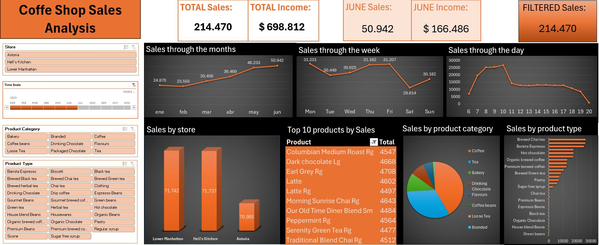

# CoffeShop-Sales-Dashboard
**Análisis exploratorio de datos (EDA) y Visualización de datos en Dashboard en Excel** utilizando un conjunto de datos que registra las ventas en una cafetería. El análisis se centra en evaluar el rendimiento de la empresa en función de varios factores, como la fecha y hora de las transacciones, el tipo y categoría de producto, y la ubicación de la tienda.

El conjunto de datos utilizado fue obtenido del sitio web de Kaggle: [Coffe Shop Sales Dataset](https://www.kaggle.com/datasets/f02d450f34d1dda2c29da2c31e4650dd98562f4887f4dbb1b7b3cd9ec3348191?select=Coffee+Shop+Sales.xlsx)

El proyecto consiste principalmente en un libro de Excel. En la hoja **Transactions** se encuentra el conjunto de datos, al que se le han añadido algunas columnas para permitir un análisis más detallado. En la hoja **DynamicTablesDB** se encuentran las tablas y gráficos dinámicos que dan soporte a la visualización en forma de dashboard, el cual ha sido creado en la hoja **DB**. Además de esto, se ha redactado un informe en el que se detallan diversas decisiones de implementación y se analizan en profundidad los insights extraídos del conjunto de datos tras el proceso de EDA y la creación del Dashboard.

**Autor:** Andrés Nó Gómez (andresnogomez@gmail.com)

